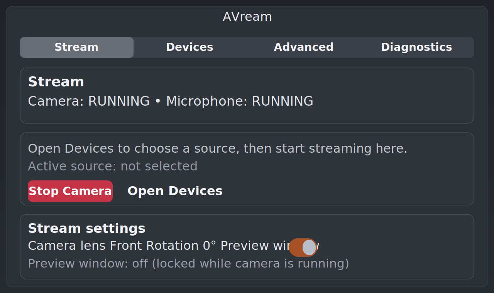

# AVream - Android Phone as Webcam and Microphone for Linux

[](https://github.com/Kacoze/avream/releases/latest)
[](LICENSE)
[](docs/SUPPORTED_PLATFORMS.md)
[](https://github.com/Kacoze/avream/actions/workflows/ci.yml)

AVream turns your Android phone into a Linux virtual camera and microphone for real meetings and recordings.

If you are looking for an Android phone as webcam on Linux, Android as microphone on Linux, or a reliable Linux virtual camera bridge for Zoom, Google Meet, and OBS, AVream is built for exactly that workflow.

Official website: https://kacoze.github.io/avream/

Website and documentation are generated from Markdown files in `docs/`.



## Why Users Pick AVream

- No dedicated app required on the phone.
- Clean phone-first UX: scan phone, connect, start camera.
- USB and Wi-Fi modes with practical reconnect flow.
- Works as standard Linux devices: `AVream Camera` and `AVream Mic`.
- Stable Linux-native pipeline (daemon + UI + helper), built for real calls.
- Security model based on polkit helper actions (no random `sudo` commands in GUI).

## Works With

- Google Meet
- Zoom
- OBS Studio
- Other apps that support Linux V4L2 camera and Pulse/PipeWire microphone devices

## Quickstart (One-liner)

Install latest AVream with automatic service setup:

```bash
curl -fsSL https://raw.githubusercontent.com/Kacoze/avream/main/scripts/install.sh | bash
```

Install a specific release:

```bash
curl -fsSL https://raw.githubusercontent.com/Kacoze/avream/main/scripts/install.sh | AVREAM_VERSION=<version> bash
```

Then launch:

```bash
avream-ui
```

Done. In the app:
1. Open `Devices`, click `Scan Phones`, connect your phone.
2. Click `Connect`.
3. Switch to `Stream` and click `Start Camera`.

## What You Get

- GUI app with tabs for `Stream`, `Devices`, `Advanced`, `Diagnostics`.
- One-click update check from the version indicator.
- Auto-connect to last used device on startup (when available).
- Optional CLI for automation and debugging.

## Install Options

- Recommended: one-liner installer (`scripts/install.sh`).
- Debian/Ubuntu: APT repository (`apt install avream`) or `.deb`.
- Fedora/openSUSE: monolithic RPM (`avream-<version>-1.x86_64.rpm`).
- Arch Linux: AUR package path (`packaging/arch/`).
- Nix/NixOS: flake package (`flake.nix`, `.#avream`).
- Manual monolithic package: `avream_<version>_amd64.deb`.
- Advanced Debian split bundle: `avream-deb-split_<version>_amd64.tar.gz` (contains `avream-daemon`, `avream-ui`, `avream-helper`, `avream-meta`).

Full install, upgrade, and uninstall guide: `docs/INSTALL.md`.

## Documentation

- User guide: `docs/USER_GUIDE.md`
- Installation and upgrade: `docs/INSTALL.md`
- CLI reference: `docs/CLI_README.md`
- Troubleshooting: `docs/TROUBLESHOOTING.md`
- FAQ: `docs/FAQ.md`
- Supported platforms: `docs/SUPPORTED_PLATFORMS.md`
- API contract: `docs/API_V1.md`

Release and security references:

- `docs/RELEASE_CHECKLIST.md`
- `docs/RELEASE_TEMPLATE.md`
- `docs/RC_DRILL.md`
- `docs/SECURITY_DECISIONS.md`

## Known Limits

- PC audio output to phone speaker is not in stable baseline.
- Preview runs as a separate `scrcpy` window, not embedded in GTK content.

## CLI (Optional)

```bash
avream status
avream devices
avream start --mode wifi --lens front
avream camera stop
```

## For Developers

Build local Linux packages:

```bash
bash scripts/build-deb.sh
bash scripts/build-deb-split.sh
bash scripts/build-rpm.sh
```

Run local docs site (Markdown source of truth):

```bash
pip install mkdocs mkdocs-material
mkdocs serve
```

Build static docs site:

```bash
mkdocs build --strict
```

Release docs copied to `dist/` are generated by:

```bash
bash scripts/generate-dist-docs.sh
```

Installer and diagnostics helpers:

```bash
bash scripts/install.sh
bash scripts/doctor.sh
bash scripts/uninstall.sh
```
