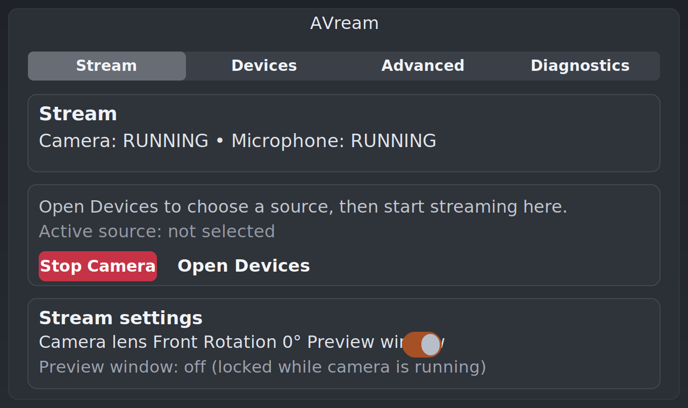

# AVream

Turn your Android phone into a Linux virtual camera and microphone for real meetings and recordings — no dedicated phone app required.

[](https://github.com/Kacoze/avream/releases/latest)
[](https://github.com/Kacoze/avream/blob/main/LICENSE)
[](SUPPORTED_PLATFORMS.md)
[](https://github.com/Kacoze/avream/actions/workflows/ci.yml)
[](https://github.com/Kacoze/avream/actions/workflows/snap.yml)
[](https://github.com/Kacoze/avream/actions/workflows/flatpak.yml)
[](https://github.com/Kacoze/avream/actions/workflows/ppa.yml)



## Why AVream

- No dedicated app required on the phone — uses ADB and scrcpy.
- Phone-first UX: scan phone, select device, start camera in three clicks.
- USB and Wi-Fi modes with automatic reconnect flow.
- Registers as standard Linux devices: `AVream Camera` (V4L2) and `AVream Mic` (PipeWire/PulseAudio).
- Includes both GUI (`avream-ui`) and CLI (`avream`) for automation.
- Security model based on polkit helper actions — no `sudo` in GUI controls.
- UI available in English, Polski, Español, العربية, and 中文.

## Works With

- **Google Meet** — select `AVream Camera` and `AVream Mic` in Meet settings
- **Zoom** — select `AVream Camera` and `AVream Mic` in Zoom audio/video settings
- **OBS Studio** — add `AVream Camera` as a V4L2 video capture source
- Any app that supports standard Linux V4L2 camera and PulseAudio/PipeWire microphone devices

## Quickstart (One-liner)

Install latest AVream:

```bash
curl -fsSL https://raw.githubusercontent.com/Kacoze/avream/main/scripts/install.sh | bash
```

Install specific version:

```bash
curl -fsSL https://raw.githubusercontent.com/Kacoze/avream/main/scripts/install.sh | AVREAM_VERSION=<version> bash
```

Launch:

```bash
avream-ui
```

Then:

1. Go to **Devices** and click **Scan Phones**.
2. Select your phone and click **Connect**.
3. Go to **Stream** and click **Start Camera**.

## CLI Quickstart

```bash
avream status
avream devices
avream start --mode wifi --lens front
avream camera stop
```

Full command reference: [CLI Reference](CLI_README.md).

## Install Options

- Recommended: one-liner installer (`scripts/install.sh`).
- Debian/Ubuntu: APT repository (`apt install avream`) or `.deb`.
- Fedora/openSUSE: monolithic RPM (`avream-<version>-1.x86_64.rpm`).
- Arch Linux: AUR package (`packaging/arch/`).
- Nix/NixOS: flake package (`.#avream`).
- Snap Store, Flatpak, and Ubuntu PPA also available.

Full guide: [Install and Upgrade](INSTALL.md).

## Known Limits

- PC audio output to phone speaker is not in stable baseline.
- Preview runs as a separate `scrcpy` window, not embedded in the GTK UI.

## Releases

- Latest release: <https://github.com/Kacoze/avream/releases/latest>
